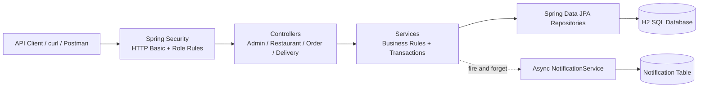
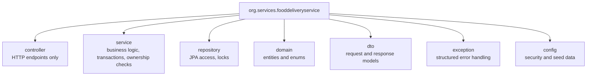
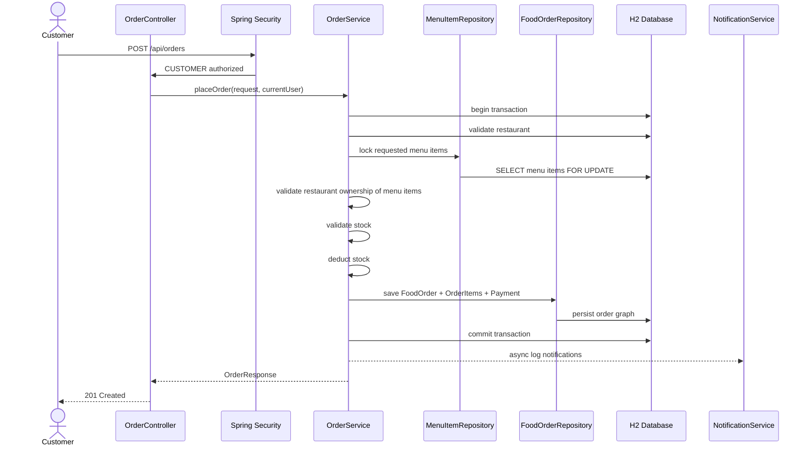
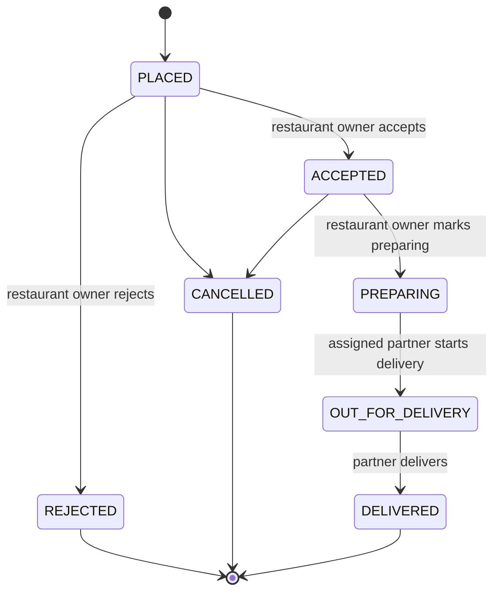
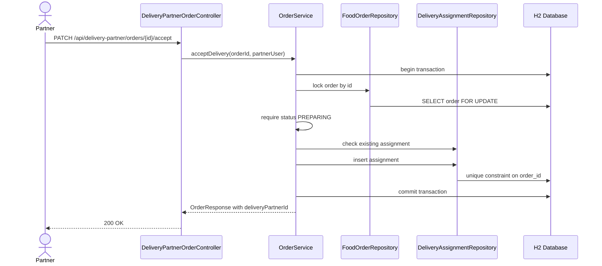
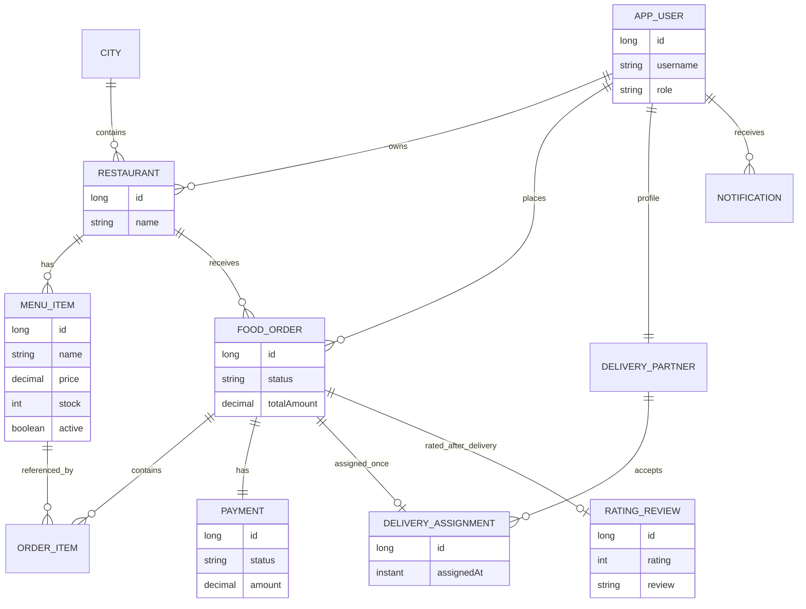
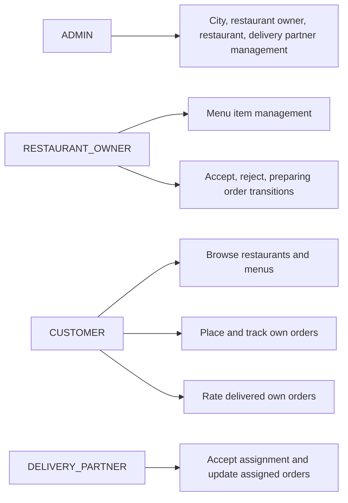

# High Level Design

## Architecture

## Main Packages

## Order Placement Flow

## Order Lifecycle

## Delivery Assignment Flow

## Data Model

## Role-Based Access

## Consistency Rules

- Order placement runs in a service-layer transaction.
- Menu rows are pessimistically locked before stock deduction.
- Menu item stock is validated before deduction and cannot go negative.
- Menu items in an order must belong to the selected restaurant.
- Order status transitions are centralized in `FoodOrder.transitionTo`.
- Delivery assignment locks the order and has a unique database constraint on `order_id`.
- Rating is allowed only when the order is `DELIVERED`.
- Async notification logging runs in a separate transaction and catches failures.
